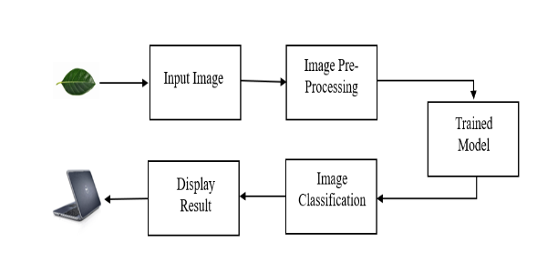
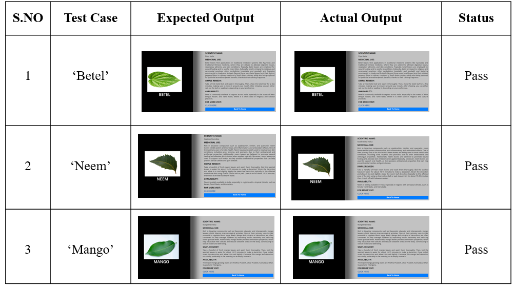

# IDENTIFICATION OF DIFFERENT MEDICINAL PLANTS USING MOBILENET

## By Bantumalli Jayaram

## Introduction

Medicinal plants play a crucial role in traditional and modern healthcare systems. They provide natural remedies for various ailments and are a source of ingredients for medicines. However, accurate identification of these plants remains a challenge, especially due to similar-looking species, seasonal variations, and geographical distribution. Misidentification can lead to ineffective treatment or even health hazards.

To address this issue, we developed a machine learning-based system for rapid identification of medicinal plants using images of their leaves. Leaves are particularly useful for identification because they are available year-round and possess unique features such as texture, shape, and vein patterns. By automating plant recognition, our system aims to support Ayurvedic practitioners, pharmaceutical companies, and herbal researchers in efficiently identifying medicinal plants.

**_ Related Work _**
Previous studies have highlighted the use of machine learning and deep learning in plant identification:

- **Transfer Learning (TL)** has been effectively applied to enhance model performance by leveraging pre-trained networks for related tasks.
- Researchers have combined **MobileNet, EfficientNetB0, and InceptionV3** to accelerate training while maintaining high accuracy.
- Deep learning models like **DenseNet201 and VGG-16** CNNs have demonstrated robust performance in identifying medicinal plants under varied conditions.
- Ensemble methods and hybrid transfer learning approaches have achieved test accuracies exceeding 95% in medicinal leaf classification.

These studies reinforce the potential of deep learning for accurate and automated plant identification, which motivated our use of **MobileNet**, a lightweight CNN optimized for mobile applications.

# Methodology

Our system utilizes **MobileNet**, a convolutional neural network architecture designed for efficiency and speed. Key features include:

- **_Depth-wise Separable Convolutions:_** Reduces computational cost by splitting standard convolution into depth-wise and point-wise operations.

- **_Width Multiplier:_** Allows shrinking the network size for faster inference.

- **\*Resolution Multiplier:** Adjusts input resolution to optimize processing speed.

# Model Architecture

To preprocessing the images for the image recognition model, we will perform some adjustments. This includes techniques to expansion in the range of training data, which eventually results in a more reliable model. The MobileNet architecture, optimize the computational cost, will be fine-tuned on the medicinal plant leaf dataset to improve its performance for this specific task.

The picture dataset will be split up into separate portions for the model's testing and training. The performance of the model may be assessed on a different testing set, and it will learn from the data.

This proposed system allowing users to provide visuals of medicinal herbs and classify them with the help of model. The platform will provide real-time feedback on the classification results, along with additional information about the identified plant species.

1. **_Image Preprocessing:_** Input leaf images undergo quality enhancement and augmentation.

2. **_Feature Extraction:_** MobileNet extracts features like color, texture, and vein patterns.

3. **_Classification:_** The model predicts the plant species among 30 types of medicinal plants.

4. **_Output:_** The system provides the plant name, medicinal properties, and common uses.

# System Implementation

In the proposed system, **MobileNet** is implemented using **Python programming language** in Visual Studio Code IDE. **MobileNet** can be built using **Kera’s**, which provides a high-level abstraction for building the model, and **TensorFlow**, which is used for training the model layer by layer. The sequential Convolutional model of **MobileNet** is used for recognizing and classifying the medicinal plant leaves.

# Advantages

1. **_High Accuracy:_** Achieves 96% accuracy in leaf classification.

2. **_Efficiency:_** MobileNet ensures fast processing on web and mobile platforms.

3. **_User-Friendly:_** Easy to use for researchers, practitioners, and general users.

4. **_Real-Time Identification:_** Provides instant feedback with medicinal information.

# Results

We tested the system with multiple leaf images:

The model’s performance was evaluated using **precision, recall, F1-score, and a confusion matrix**, confirming high accuracy across all classes.

# Evaluation Metrics

Precision, recall, F1 Score are three key measures used to assess performance.

# Confusion Matrix

The accuracy score shows how well the model did overall, and for each category, it tells us how many predictions were correct.

# Accuracy

The Performance of the model is defined by it's accuracy, which measures how well it performs its task. After training and testing, we found that our model achieved an accuracy of 98%.

# Conclusion

This system successfully integrates **deep learning and image processing** for automated medicinal plant identification. By leveraging **MobileNet and transfer learning**, it offers a reliable, efficient, and lightweight solution suitable for real-world applications. This tool can significantly aid herbal research, medicine production, and educational purposes.

# Future Enhancements

- Expand the dataset to include more plant species and images.
- Refine image preprocessing techniques for better accuracy.
- Explore advanced machine learning algorithms and ensemble models.
- Develop mobile applications for wider accessibility.
- Collaborate with botanists for improved validation and real-time feedback.

# References

[1] Hosna, A., Merry, E., Gyalmo, J. et al. “Transfer learning: a friendly introduction”. J Big Data 9, 102 (2022). [Link](https://doi.org/10.1186/s40537-022-00652-w)

[2] M. Rybczak, K. Kozakiewicz “Deep Machine Learning of MobileNet, Efficient, and Inception Models”. Algorithms 2024, 17, 96. [Link](https://doi.org/10.3390/a17030096)

[3] Sachar S., Kumar A. Deep ensemble learning for automatic medicinal leaf identification. Int. j. inf. tecnol. 14, 3089–3097 (2022). [Link](https://doi.org/10.1007/s41870-022-01055-z)

[4] Biplob Dey, Jannatul Ferdous, Romel Ahmed and Juel Hossain Assessing deep convolutional neural network models and their comparative performance for automated medicinal plant identification from leaf images. (2024) [Link](https://doi.org/10.1016/j.heliyon.2023.e23655)

[5] Yousef Sharrab, Dimah Al Fraihat, Monther Tarawneh, Ahmad Sharieh Med222222icinal Plants Recognition Using Deep Learning. published in 2023 International Conference on Multimedia Computing, Networking and Applications (MCNA). [Link] (https://ieeexplore.ieee.org/document/10185880)

[6] Yuanita A. Putri, Esmeralda C. Djamal, Ridwan Ilyas. “A Identification of Medicinal Plant Leaves Using Convolutional Neural Network”, ICIASGA 2020; Journal of Physics: Conference Series 1845 (2021); [Link](https://iopscience.iop.org/article/10.1088/1742-6596/1845/1/012026)

[7] Owais A. Malik, Nazrul Ismail, Burhan R. Hussein, and Umar Yahya Automated Real-Time Identification of Medicinal Plants Species in Natural Environment Using Deep Learning Models. Published online 2022 Jul 27.
[Link](https://doi.org/10.3390/plants11151952)

[8] Naeem S, Ali A, Chesneau C, Tahir MH, Jamal F, Sherwani RAK, Ul Hassan M. The Classification of Medicinal Plant Leaves Based on Multispectral and Texture Feature Using Machine Learning Approach. Agronomy. 2021; 11(2):263. [Link](https://doi.org/10.3390/agronomy11020263)

[9] Sukanta Ghosh, Amar Singh, Shakti Kumar. “Identification of medicinal plant using hybrid transfer learning technique”. Indonesian Journal of Electrical Engineering and Computer Science Vol. 31, No. 3, September 2023, pp. 1605~1615, ISSN: 2502-4752. [Link](http://doi.org/10.11591/ijeecs.v31.i3.pp1605-1615)
